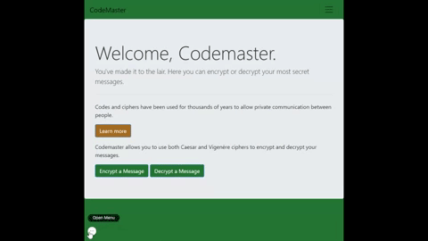
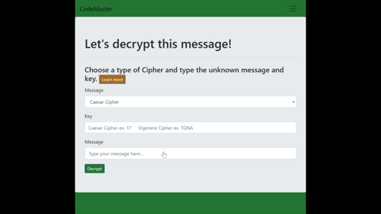
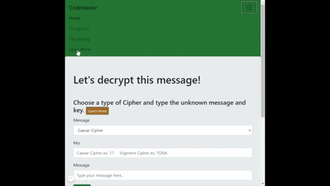

# Codemaster2.0
 Web app that allows users to encrypt and decrypt messages using ciphers.
 
## Take a Look!
#### Encrypt Messages

#### Decrypt Messages

#### Learn More

## Run this project on your machine:

1.Install Eclipse

2.Go to this path: File -> İmport -> Git -> Projects From Git ->  Clone URI

3.In the URI section copy and paste this: https://github.com/Charmaine-Burrus/Codemaster2.0

4.In the same window, fill the user and password blanks with the username and password of your Github account.

5.Click Next several times to finish the importing the project.

6.To run the app, find Application.java in Project Explorer. Go to CodeMaster2.0 -> Java Resources -> src/main/java -> com.burrus.Codemaster20.

7.Right clisk on Application.java -> Run As -> Java Application

8.Open your preferred web browser and paste this: http://localhost:4000/Codemaster2.0/
